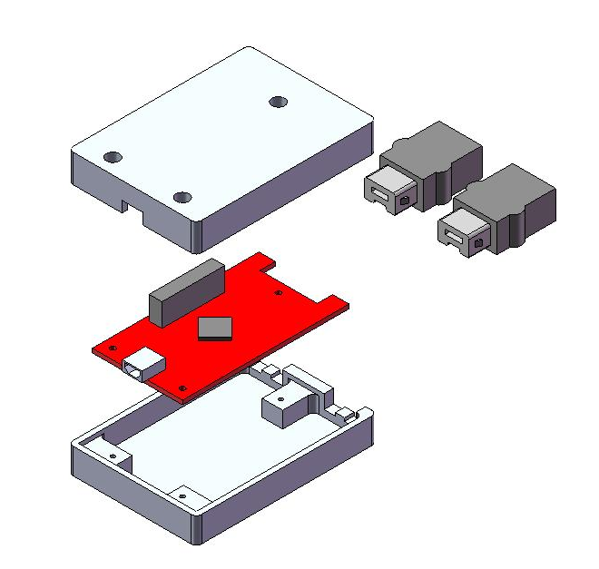

# Concept

I always liked the game [Descent](https://www.youtube.com/watch?v=kfDTCge_Hwk) when I was in high school.

I felt like I could put some of my electronics knowledge to good use and make a device that would allow me to control the vehicle in all six degrees of freedom (DOF).  
I looked around sevral websites and I found out that someone had already cracked the Wii's controller protocols (they're all just I2C apparently).  

I thought "why not just use two nunchuks to get a buttload of axes to play with?"  That results in two X/Y joysticks and 2x pitch/roll indicators from the accelerometers (8 degrees of freedom)!!!  The extra four buttons would be most welcome too.  Here's an "engineer's rendition" of the idea- the Wii Nunchuk connectors are shown on the right:

I started this project back in March 2010 and now (October 2010) I have a working PCB housed in a little box that connects to a computer's USB port.

