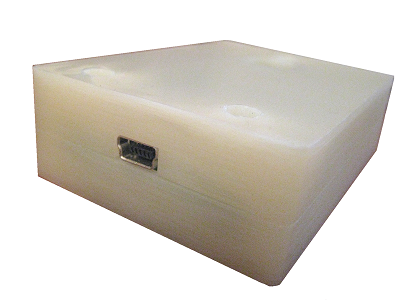
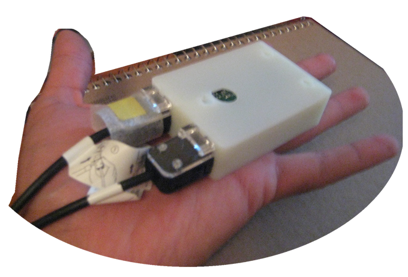

# Hardware: Housing

The Nunchuk connects to the Wiimote through a 6-pin proprietary connector, and it locks into place with spring-loaded teeth.

The housing I designed has the openings for the nunchuk on one side (the wall thickness allows the teeth to latch properly while making contact) and a standard 5-pin mini-USB connector on the other one.

Here are some pictures of the rapid prototype I had made.

I have uploaded PDFs of all 3D models I produced to this folder:

[Housing Bottom](./HousingBottom.pdf)

[Housing Top](./HousingTop.pdf)

[PCB](./NunchukUSBPCB.pdf) 
