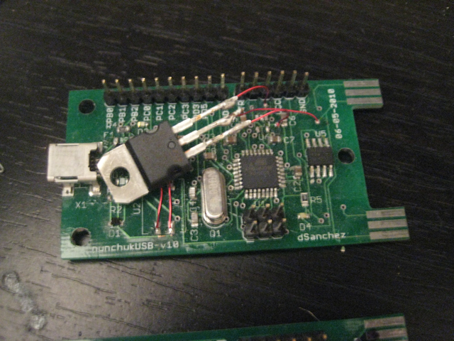
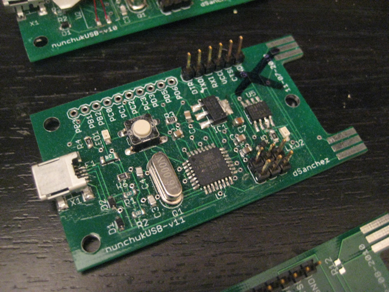
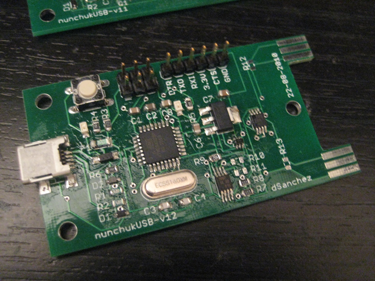

# Hardware: Electronics

## The basics

This board is powered by an Atmel ATMega328 microcontroller - I built the first breadboard prototype using an Arduino Duemilanove and a couple of nunchuk adapters I found at Sparkfun.  Most of the work had already been done by the following projects:

### V-USB
This is a software implementation of the USB protocol for using a wide variety of Atmel processors as USB devices.  VERY well done.

### wii-ext-to-usb
Someone had already managed to hook up both the Wii classic controller and nunchuk (AND a PS3 controller) to a computer using the same microcontroller, so a lot of the code was already in place.  This project in turn gives due credit to a few more projects.

## The next step

- Both nunchuks have the same I2C address, so I had to add a chip to multiplex the same I2C SDA data line.  
I used Maxim's 4733 to do this, it's a simple NC/NO 2-channel switch.  It requires an extra input for switching between the two devices, which was provided by the microcontroller too.  

## Circuit boards

I ordered all my PCBs from BatchPCB, and they were about $10 each (they always sent me an extra one though) plus shipping.  It's a really nice service to use if you only have a couple of boards you want to make.  Here is a breakdown of the revisions I made:

### v1.0

The 3.3V power supply didn't quite work as I expected, so I ended up wiring a thru-hole LD1117 to the board- ugly, but it worked.

### v1.1

The 3.3V power supply worked just as advertised this time around.  Sadly, I had left the I2C lines at mismatched levels (5V/3.3V) and the ATMega couldn't talk to the nunchuks.  To make matters worse, I fried the microcontroller when I was probing around with my multimeter. Fail.

### v1.2

I added voltage level translators to switch from the 4.7V powering the ATMega to the 3.3V for the switch chip and nunchuks.  I ended up not placing the pull-up resistors on the nunchuks side, and it worked right away after programming the microcontroller. Success!

v13:  I removed the pull-up resistors on the nunchuks side.  I haven't had it built.

## Source

I have uploaded the latest Eagle schematic and board layouts to this folder. The schematic is also provided in PDF form. 

The code can be found in the Software section.
